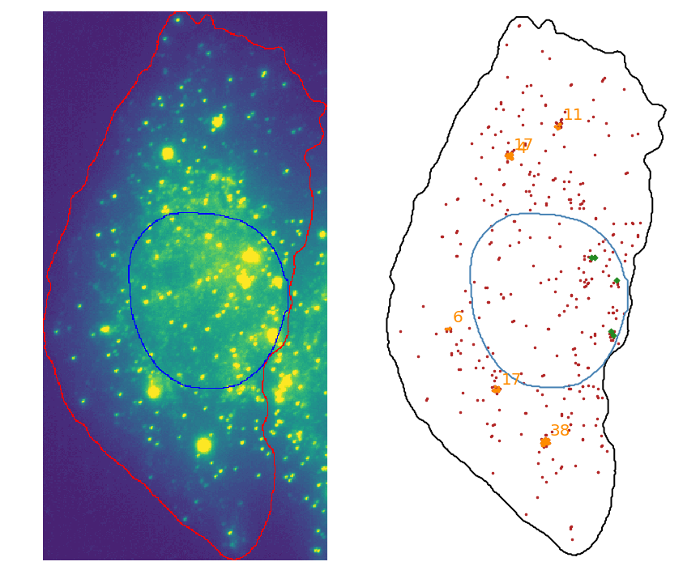

# Big-FISH

[](https://github.com/fish-quant/big-fish/blob/master/LICENSE)
[](https://codecov.io/gh/fish-quant/big-fish)


**Big-FISH** is a python package for the analysis of smFISH images. It includes various methods to **manipulate microscopic images**, **detect spots** and **segment relevant area** of the cells. The package allows the user to extract specific signal from images and build a coordinate representation of the cells. The ultimate goal is to ease **large scale statistical analysis** and quantification.

| Cell image (smFISH channel) and its coordinates representation |
| ------------- |
|  |

## Installation

### Dependencies

Big-FISH requires Python 3.6 or newer. Additionally, it has the following dependencies:

- numpy (>= 1.16.0)
- scipy (>= 1.2.0)
- scikit-learn (>= 0.20.2)
- scikit-image (>= 0.14.2)
- matplotlib (>= 3.0.2)
- pandas (>= 0.24.0)
- mrc (>= (0.1.5)
- pip (>= 18.1)

### User installation

To avoid dependency conflicts the use of a dedicated [virtual](https://docs.python.org/3.6/library/venv.html) or [conda](https://docs.conda.io/projects/conda/en/latest/user-guide/tasks/manage-environments.html) environment should be a considered option.

#### From PyPi

Use the package manager [pip](https://pip.pypa.io/en/stable/) to install Big-FISH. In a terminal run the command:

```bash
pip install bigfish
```

#### From Github

Clone the project's [Github repository](https://github.com/fish-quant/big-fish) and install it locally with the following commands:

```bash
git clone git@github.com:fish-quant/big-fish.git
cd big-fish
pip install .
```

## Usage

Big-FISH provides a toolbox for the full analysis pipeline of smFISH images:
- Use `bigfish.stack` subpackage for I/O operations, preprocessing and postprocessing.
- Use `bigfish.segmentation` subpackage for nucleus and cell segmentation.
- Use `bigfish.detection` subpackage for mRNAs detection.
- Use `bigfish.plot` subpackage for plotting routines.
- Use `bigfish.classification` subpackage for pattern recognition tasks.

Several examples are developed in the [examples](https://github.com/fish-quant/big-fish/tree/master/examples) directory.

## Support

If you have any question relative to the repository, please open an [issue](https://github.com/fish-quant/big-fish/issues). You can also contact [Arthur Imbert](mailto:arthur.imbert@mines-paristech.fr) or [Florian Mueller](mailto:muellerf.research@gmail.com).

## Roadmap (suggestion)

Version 0.4.0:
- Refactor `bigfish.classification` subpackage.
- Add pattern recognition examples.

Version 0.5.0:
- Switch to tensorflow 2.0.0.
- Integrate a deep learning model for segmentation.

Version 1.0.0:
- Complete code coverage.
- Add sphinx documentation.

## Development

### Source code

You can access the latest sources with the commands:

```bash
git clone git@github.com:fish-quant/big-fish.git
git checkout develop
```

### Contributing

[Pull requests](https://github.com/fish-quant/big-fish/pulls) are welcome. For major changes, please open an [issue](https://github.com/fish-quant/big-fish/issues) first to discuss what you would like to change.

### Testing

Please make sure to update tests as appropriate if you open a pull request. You can install exacts dependencies and specific version of [pytest](https://docs.pytest.org/en/latest/) by running the following command:

```bash
pip install -r requirements_dev.txt
```

To perform unitary tests, run : 

```bash
pytest bigfish
```
